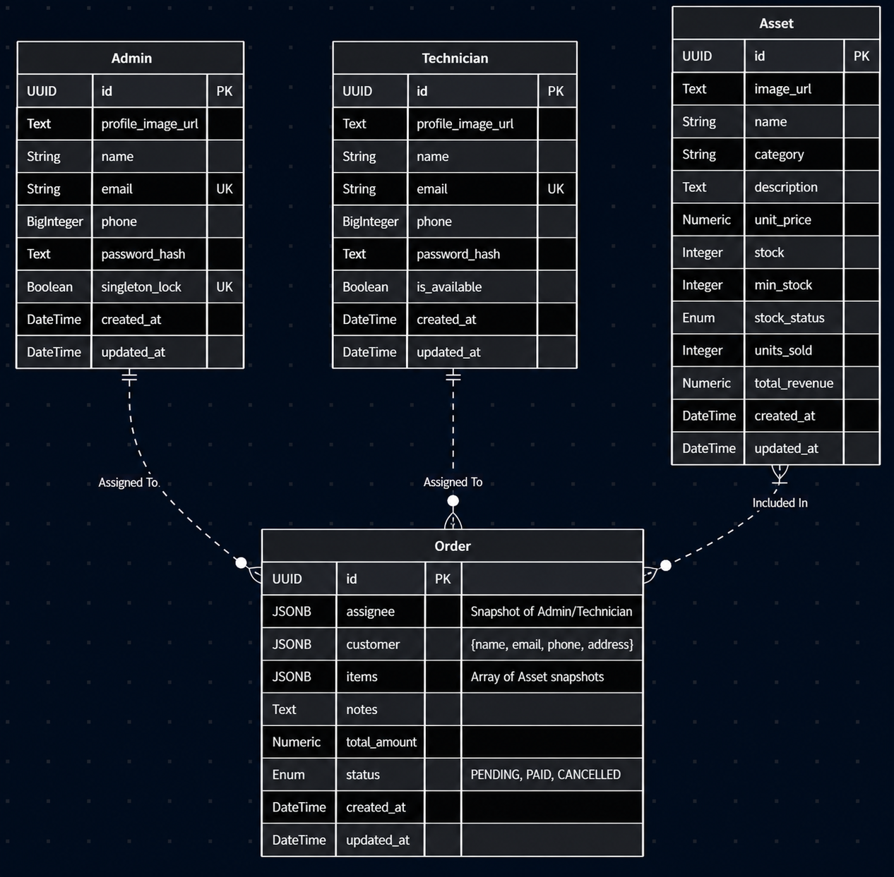

<!--  -->
<!--
<p align="center">
  
</p> -->

# CelerityForge

**CelerityForge** is a robust, full-stack Inventory & Staff Management System designed to streamline technical operations, asset tracking, and order fulfillment. Built with a high-performance FastAPI backend and a dynamic React frontend, it features role-based access control, interactive analytics, and seamless payment processing.


## Key Features

- **Role-Based Access Control (RBAC):** Distinct workflows and permissions for **Admins** (full system control, reassignment, global analytics) and **Technicians** (task execution, localized order management).
- **Interactive Dashboards:** Real-time data visualization using `Recharts`, featuring monthly revenue bar charts, categorical sales pie charts, and top-performing product lists.
- **Advanced Order Management:** Complete lifecycle tracking from creation to fulfillment. Includes dynamic workflow assignments, internal notes, PDF receipt generation, and status monitoring.
- **Immutable Order History:** Utilizes PostgreSQL `JSONB` fields to create immutable snapshots of customers, assignees, and items at the time of purchase, preventing historical data mutation when inventory changes.
- **Integrated Payment Gateway:** Secure checkout flow powered by **Razorpay**.
- **Smart Inventory Tracking:** Real-time asset valuation, stock level monitoring, and automated "Low Stock" / "Out of Stock" indicators.


## Database Schema

<p align="center">
  
</p>

## Tech Stack

### Frontend

- **Framework:** React.js (Vite)
- **Styling:** Tailwind CSS (Custom "Apex Grid" Brutalist UI)
- **State Management:** React Context API
- **Routing:** React Router DOM
- **Data Visualization:** Recharts
- **Icons & Toasts:** React Icons, React Hot Toast

### Backend

- **Framework:** FastAPI (Python)
- **Database:** PostgreSQL
- **ORM:** SQLAlchemy
- **Integrations:** Razorpay API (Payments), Cloudinary (Media Management)


## Installation & Setup

### 1. Clone the Repository

```bash
git clone https://github.com/yourusername/celerityforge.git
cd celerityforge
```

### 2. Backend Setup

Navigate to the backend directory and set up your Python environment:

```bash
cd backend
python -m venv .venv

# Activate the virtual environment

# Windows
.venv\Scripts\activate

# macOS/Linux
source .venv/bin/activate

# Install dependencies
pip install -r requirements.txt
```

Create a `.env` file inside `backend/`:

```env
JWT_SECRET_KEY=your_jwt_secret_key
ALGORITHM=HS256
ACCESS_TOKEN_EXPIRE_MINUTES=1440

CLOUDINARY_CLOUD_NAME=your_cloud_name
CLOUDINARY_API_KEY=000000000000000
CLOUDINARY_API_SECRET=your_api_secret
CLOUDINARY_FOLDER=your_folder_name  # if you have one

POSTGRES_USER=postgres
POSTGRES_PASSWORD=postgres
POSTGRES_HOST=localhost
POSTGRES_PORT=5432
POSTGRES_DB=db_name

# Razorpay
RAZORPAY_KEY_ID=your_test_key_id
RAZORPAY_KEY_SECRET=your_test_key_secret
```

Start the FastAPI server:

```bash
uvicorn app.main:app --reload
```

### 3. Frontend Setup

Open a new terminal and run:

```bash
cd frontend
npm install
```

Create a `.env` file inside `frontend/`:

```env
VITE_BACKEND_URL=http://localhost:8000
VITE_RAZORPAY_KEY_ID=your_test_key_id
```

Start the development server:

```bash
npm run dev
```
